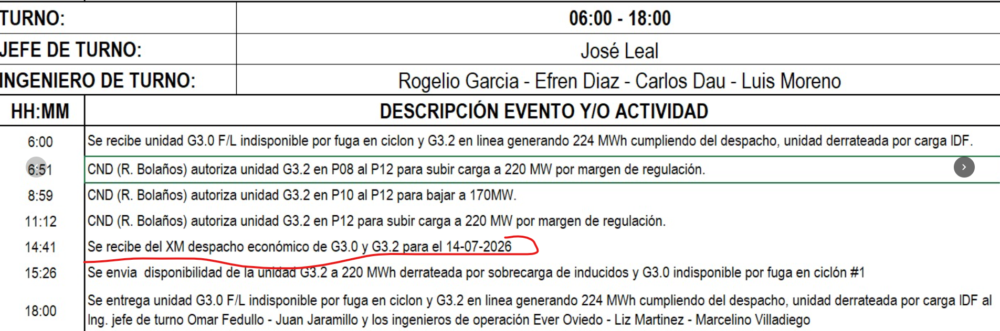

# REQ-05 — Asiento automático cuando llega el despacho del día siguiente

| Campo | Valor |
|---|---|
| **Código** | REQ-05 |
| **Título** | Asentar en las bitácoras de Sala y en el libro GENE-F03 la llegada del despacho económico del día siguiente publicado por XM |
| **Estado** | 🟢 **Listo para planificar** — desbloqueado el 2026-08-31; plantilla, alcance y las dos preguntas de §8 cerradas por el autor. **Sin preguntas abiertas.** |
| **Origen** | `pendientes_Ernesto.md`: *"cuando cambia despacho (redesp<>desp por correo o registro) crear histórico en op24hr con el formato en la imagen"* — **reformulado por el autor el 2026-08-31** (ver §1.1) |
| **Depende de** | [REQ-02](./REQ-02-reflejo-bitacoras-sala.md) ✅ (D-058 + D-063), [REQ-04](./REQ-04-historico-en-apartado.md) ✅, [REQ-06](./REQ-06-excel-eventos-operacion.md) ✅ (D-058) |
| **Cross-repo** | ⚠️ Requiere un cambio pequeño en `dashboard-gen-gec3` y una entrada nueva en `docs/interfaces-cross-repo.md`. **La comunicación es por la BD compartida, no por HTTP** (§5.1). |

---

## 1. Contexto y problema

El F03 real registra a mano, todos los días, el momento en que llega el despacho económico que XM
publica para el día siguiente. En la hoja del día se lee así:

```
14:41  Se recibe del XM despacho económico de G3.0 y G3.2 para el 14-07-2026
```



*Recorte del GENE-F03 real aportado por el autor el 2026-08-31; el renglón señalado es el que este
requerimiento automatiza. Fuente en `docs/requerimientos/formatos/`.*

Ese renglón hoy lo escribe una persona. El dato para escribirlo solo lo tiene el otro repositorio
del workspace —`dashboard-gen-gec3` es quien vigila el portal de XM— y Bitácora, que es donde vive
el libro y las bitácoras de Sala, no se entera de nada.

### 1.1 Reformulación del 2026-08-31 (reemplaza el alcance anterior)

Este requerimiento nació de una nota que mezclaba dos cosas. El autor las separó así:

1. **El redespacho tecleado en Operación 24h ya está resuelto.** Cuando un ingeniero registra un
   redespacho en la grilla, su asiento ya se copia correctamente a `SALAJDT` y `SALAING`. Lo cerró
   **D-058** (motor de asientos + reflejo) y lo completó **D-063**. **No hay trabajo nuevo acá.**

2. **Lo que falta es el despacho del día siguiente**, que es el objeto real de este documento.

3. **El redespacho que llega por correo del CND queda FUERA POR COMPLETO.** La versión anterior de
   este documento giraba alrededor de `emailDispatch.js`, de un canal HTTP nuevo y de conservar el
   despacho original que el parser descarta. **Nada de eso aplica ya** (§7).

## 2. Comportamiento actual

| Aspecto | Situación hoy |
|---|---|
| Redespacho tecleado en la grilla | ✅ Genera su asiento y se copia a las dos bitácoras de Sala (D-058, D-063). |
| Llegada del despacho del día siguiente | El dashboard la detecta (`despachoscraper.js`, `#refreshTomorrow()`) pero **solo prende un flag en memoria y escribe un `console.log`**. No lo persiste. Al reiniciar el servicio, el dato se pierde. |
| Lo que sí se persiste | `dashboard.despacho_programado`, pero es **el archivo de HOY** (`saveDespachoProgBulk(todayStr, …)`), no el de mañana. Su `created_at` cae hacia las 00:0x, no a la hora en que llegó el despacho del día siguiente. |
| El libro GENE-F03 | Lee cuatro fuentes, entre ellas las dos bitácoras de Sala **excluyendo las copias** (`origen_bitacora IS NULL`). Un registro creado directamente en Sala ya entra al libro sin tocar el armado. |

## 3. Comportamiento requerido

### 3.1 El disparador

- **RQ-05.1** — El asiento se genera **cuando el dashboard detecta que XM publicó el archivo de
  despacho del día siguiente**. Es el único disparador de este requerimiento.
- **RQ-05.2** — El dashboard **persiste ese hecho** (fecha del despacho + instante de detección) en
  su propio esquema. Hoy solo vive en memoria; ese es el cambio en el otro repositorio.
- **RQ-05.3** — Bitácora **lee ese hecho de la base compartida** y crea el asiento. No hay endpoint
  nuevo ni notificación HTTP (§5.1).

### 3.2 El asiento

- **RQ-05.4** — Texto **literal**, tomado del F03 real:

  ```
  Se recibe del XM despacho económico de G3.0 y G3.2 para el DD-MM-AAAA
  ```

  `DD-MM-AAAA` es la fecha **del despacho** (el día siguiente), con guiones. La notación `G3.0` /
  `G3.2` se conserva tal cual está escrita a mano en el formato: es una **excepción deliberada** a la
  convención de unidades `GEC3`/`GEC32` de [`FORMATO-ASIENTOS-OPERACION.md`](./FORMATO-ASIENTOS-OPERACION.md) §4,
  porque acá el texto es una frase fija y no una plantilla parametrizada por unidad.
- **RQ-05.5** — **Un solo asiento nombra a las dos unidades.** No se genera uno por unidad.
- **RQ-05.6** — La **hora** del asiento es el instante en que el dashboard detectó el archivo. El
  scraper reintenta cada 5 minutos, así que la hora tiene ese margen respecto a la publicación real
  en XM; se acepta.
- **RQ-05.7** — El **autor** es el usuario `SISTEMA` (ya seedeado, `activo = 0`, nunca loguea —
  D-015; mismo patrón que el cierre automático de fin de día).

### 3.3 Dónde aparece

- **RQ-05.8** — Se crea **un registro en `SALAJDT` y otro en `SALAING`**, directamente. **No** pasa
  por Operación 24h.
- **RQ-05.9** — **No lleva `campos_extra.origen_bitacora`**: no es una copia reflejada sino un
  registro original de Sala. Gracias a eso el libro GENE-F03 lo toma por la fuente que **ya existe**
  (`eventosSala`, que excluye solo los reflejados) y no hace falta agregarle una quinta fuente.
- **RQ-05.10** — **Las dos filas cuentan como UN renglón en el libro.** `eventosSala` deduplica hoy
  únicamente por `registro_id`, así que sin una clave compartida el asiento saldría **dos veces** en
  la misma hoja. Las dos filas llevan una **clave de agrupación común** en `campos_extra` y el
  armado del libro las colapsa, con el mismo criterio con que agrupa las celdas de un lote de MAND
  por `lote_id`.
- **RQ-05.11** — El asiento **no llena ninguna celda** de la grilla de captura de Operación 24h.
- **RQ-05.12** — El asiento **no se publica al dashboard de generación**: el dato vino de ahí y
  reenviarlo sería un ciclo.

### 3.4 Idempotencia y relleno del mes

- **RQ-05.13** — **Un solo asiento por fecha de despacho.** El detector puede correr muchas veces
  (reintentos cada 5 minutos, reinicios del servicio) y el asiento no se duplica.
- **RQ-05.14** — **Relleno del mes en curso.** Para los días **ya pasados** del mes, y para el día
  de hoy si el despacho ya llegó, se crean los asientos faltantes con **hora fija `15:00`**, porque
  la hora real de esos días no existe como dato y nunca se guardó (§5.2). Esos asientos quedan
  **marcados como hora estimada** para que nadie los lea como una medición.
- **RQ-05.15** — El relleno es **idempotente** y no pisa un asiento que ya tenga hora real.
- **RQ-05.16** — **Bitácora lee cada 5 minutos**, la misma cadencia con la que el scraper del
  dashboard reintenta contra XM (`RETRY_MS`). No tiene sentido leer más seguido que lo que tarda
  el hecho en aparecer. En el peor caso el asiento se ve ~10 minutos después de que XM publicó
  (hasta 5 en detectarlo, hasta 5 en leerlo), pero **eso no distorsiona la hora registrada**: el
  asiento lleva el instante de detección (RQ-05.6), no el de lectura.

## 4. Reglas de negocio y casos borde

- **RN-05.a** — Solo se asientan las plantas de Bitácora: **`GEC3` y `GEC32`**. Los despachos de
  `TGJ1` y `TGJ2`, que el dashboard también vigila, se ignoran.
- **RN-05.b** — La planta de test `TST` nunca recibe asientos automáticos (D-030), y `TSR` tampoco.
- **RN-05.c** — **Mejora degradable.** Si el dashboard no escribe el hecho —servicio caído, XM sin
  publicar, columna sin migrar— Bitácora funciona exactamente como hoy y solo se pierde el asiento.
  Nunca la operación. Mismo criterio que la mejora de texto por IA (D-047), que degrada sin
  configuración.
- **RN-05.d** — Si el despacho **no llega** un día, **no hay asiento** para ese día. No se inventa
  un renglón.
- **RN-05.e** — El asiento automático **no** está sujeto al bloqueo de turno finalizado ni al de
  turno cerrado: no es una captura del operador, es el registro de un hecho ya ocurrido.
- **RN-05.f** — **Zona horaria.** El motor de la base corre en **hora Bogotá**, no UTC
  (`SYSDATETIME()` da 08:56 mientras `SYSUTCDATETIME()` da 13:56), y el esquema `dashboard` usa
  `GETDATE()`. Bitácora guarda UTC (D-020). La conversión se hace **una sola vez y explícitamente**
  al leer el hecho; no se asume que las dos columnas hablen el mismo idioma.
- **RN-05.g** — **Nadie edita ni borra el asiento automático desde la interfaz.** Es un hecho del
  sistema, no una captura de nadie: su autor es `SISTEMA` y en las bitácoras de Sala la edición
  está limitada al autor (D-049), así que la restricción **sale sola de las reglas que ya existen**
  y no hay que programar nada para conseguirla. **No se abre una excepción por `puede_crear`**
  como la que MAND tiene desde D-057. Corregir un asiento errado es una intervención deliberada
  por script, con constancia — no una acción de pantalla.
- **RN-05.h** — El asiento pertenece al día en que **se recibió**, no al día del despacho que
  anuncia: el renglón `14:41 … para el 14-07-2026` vive en la hoja del **13**.

## 5. Impacto técnico

### 5.1 La comunicación cross-repo es por BD compartida

**Los dos repositorios usan la misma base de datos**, con esquemas distintos: `bitacora` y `lov_bit`
para Bitácora, `dashboard` para el dashboard. Verificado el 2026-08-31 consultando
`dashboard.despacho_programado` con las credenciales de Bitácora.

Eso **elimina** el canal HTTP que planteaba la versión anterior de este documento, y con él la
pregunta de las notificaciones perdidas: si Bitácora está caída cuando llega el despacho, lo asienta
cuando vuelva, porque el hecho quedó escrito en la base. **No** se construye ningún endpoint nuevo,
ningún token servicio-a-servicio y ninguna dependencia de red entre los dos procesos.

Sigue valiendo la regla de propiedad: **cada repo escribe solo en su esquema**. El dashboard escribe
el hecho en `dashboard`; Bitácora lo lee y escribe el asiento en `bitacora`. Ninguno escribe en el
esquema del otro.

### 5.2 Hallazgos del 2026-08-31 que condicionan el trabajo

1. **La hora de llegada del despacho del día siguiente no existe como dato.** `#refreshTomorrow()`
   detecta el archivo y solo hace `this.#foundTomorrow = true` más un `console.log`. Persistirlo es
   el cambio en el otro repo, y es la razón por la que RQ-05.14 necesita una hora fija para el
   pasado.
2. **`dashboard.despacho_programado` está detenido.** La última fecha registrada es **2026-07-19**,
   seis semanas atrás. Sea cual sea la causa, no se puede contar con esa tabla como fuente.
3. **Bug de fecha en el otro repo, ajeno a este requerimiento pero contaminante.**
   `getColombiaDate()` devuelve un `Date` cuyos campos locales son Bogotá, y después se le aplica
   `.toISOString()`, que reaplica el offset UTC: pasadas las 19:00 Bogotá el "hoy" se corre al día
   siguiente. Se ve en los datos (`fecha = 2026-07-03` insertada el 02 a las 21:59;
   `fecha = 2026-06-30` insertada el 29 a las 19:16). **Conviene arreglarlo, pero es una decisión
   aparte**: no se mezcla con este flujo sin declararlo.
4. **`docs/interfaces-cross-repo.md` miente sobre el contrato que ya existe** y hay que corregirlo
   antes de documentar el nuevo: dice que la respuesta es `{ items: [...] }` cuando el código
   devuelve `{ eventos: [...] }`; lista columnas `detalle` y `funcionariocnd` que el `SELECT` real no
   devuelve; documenta `?tipo=&planta_id=` cuando el endpoint **exige `fecha`** y responde 400 si
   falta; y no menciona ni el gate `DASHBOARD_API_TOKEN` ni la exclusión de la planta `TST`.

### 5.3 Archivos a tocar

**En `dashboard-gen-gec3`:**

| Archivo | Cambio |
|---|---|
| `server/db.js` | Tabla nueva en el esquema `dashboard` para el hecho: fecha del despacho (única) + instante de detección. |
| `server/despachoscraper.js` | En `#refreshTomorrow()`, persistir la detección la primera vez que encuentra el archivo. |

**En `Bit-cora-g3`:**

| Archivo | Cambio |
|---|---|
| `server/utils/asientos/` | Plantilla del texto de RQ-05.4. |
| `server/utils/` | Lector del hecho + creación de las dos filas de Sala, idempotente. Enganchado a un barrido periódico (patrón del `mand-sweeper`). |
| `server/utils/f03-datos.js` | Colapsar por la clave de agrupación de RQ-05.10 en `eventosSala`. |
| `server/scripts/` | CLI del relleno del mes (RQ-05.14), resumible y con `--dry-run`, como el backfill de D-060. |
| `../docs/interfaces-cross-repo.md` | Corregir el Contrato 1 y documentar el contrato nuevo por BD compartida. |

### 5.4 Riesgo de acoplamiento

Es el único requerimiento que acopla los dos repos en un sentido nuevo, pero el acoplamiento es
**de datos y no de red**: una tabla del esquema `dashboard` que Bitácora lee. Si esa tabla no existe
todavía, el lector no encuentra nada y no pasa nada (RN-05.c).

## 6. Criterios de aceptación

1. **Dado** que XM publica el despacho del día siguiente y el dashboard lo detecta, **cuando** miro
   `SALAJDT` y `SALAING`, **entonces** aparece el asiento en las dos, con autor `SISTEMA` y sin que
   nadie haya tecleado nada.
2. **Dado** ese asiento, **entonces** su texto es exactamente
   `Se recibe del XM despacho económico de G3.0 y G3.2 para el DD-MM-AAAA`, con la fecha del día
   siguiente.
3. **Dado** ese asiento, **cuando** genero el libro GENE-F03 del mes, **entonces** aparece **una sola
   vez** en la hoja del día en que se recibió, a la hora de detección.
4. **Dado** que el detector corre varias veces el mismo día, **entonces** existe **un solo** asiento.
5. **Dado** que corro el relleno del mes, **entonces** los días pasados quedan con su asiento a las
   `15:00` marcado como hora estimada, sin pisar ninguno que ya tuviera hora real, y volver a
   correrlo no duplica nada.
6. **Dado** un despacho de `TGJ1` o `TGJ2`, **entonces** Bitácora no asienta nada.
7. **Dado** que el día no llegó despacho, **entonces** no hay renglón para ese día.
8. **Dado** que la tabla del dashboard no existe o el dashboard está caído, **entonces** Bitácora
   opera normalmente y solo deja de recibir asientos automáticos.
9. **Dado** el asiento, **cuando** miro la grilla de captura de Operación 24h, **entonces** las
   celdas siguen vacías.
10. **Dado** el asiento, **cuando** consulto lo publicado al dashboard, **entonces** no se republicó
    nada por su causa.
11. **Dado** un asiento automático, **cuando** un JdT o un Ing. de Operación lo mira en su
    bitácora de Sala, **entonces** no tiene lápiz ni basurero, y un `PUT`/`DELETE` directo contra
    la API tampoco lo deja tocar.
12. **Dado** `docs/interfaces-cross-repo.md`, **entonces** describe correctamente el shape real de
    `GET /api/eventos-dashboard` y el contrato nuevo por BD compartida.

## 7. Fuera de alcance

- **Todo lo relacionado con el redespacho por correo del CND.** `emailDispatch.js` no se toca, no se
  conserva el despacho original que su parser descarta, y no se asienta nada que venga del buzón.
- **El asiento del redespacho tecleado en la grilla**: ya funciona (D-058 + D-063).
- Asentar el retorno al despacho programado.
- Asentar despachos de las plantas Guajira.
- Reconstruir asientos de meses anteriores al mes en curso.
- Arreglar el bug de `getColombiaDate()` del otro repo (§5.2 punto 3) y reactivar
  `despacho_programado` (punto 2): son trabajos propios, se documentan acá pero no entran.
- Construir un canal HTTP entre los repos: no hace falta (§5.1).

## 8. Preguntas abiertas

### 8.1 ✅ RESUELTA (2026-08-31) — plantilla, origen, hora y relleno

Las cuatro decisiones que bloqueaban este documento las cerró el autor:

- **Plantilla**: literal del F03, con `del XM` y la notación `G3.0` / `G3.2` (RQ-05.4).
- **Dónde nace el asiento**: directamente en las dos bitácoras de Sala, no como registro de
  Operación 24h (RQ-05.8). De ahí sale la exigencia de la clave de agrupación de RQ-05.10.
- **Hora**: el instante en que el dashboard detecta el archivo, con el margen de 5 minutos del
  reintento (RQ-05.6).
- **Relleno del mes**: sí, con hora fija `15:00` marcada como estimada (RQ-05.14).

### 8.2 ✅ RESUELTA (2026-08-31) — nadie corrige un asiento automático

**Se acepta tal cual: es un evento del sistema.** Su autor es `SISTEMA` y D-049 limita la edición al
autor, así que nadie lo toca desde la interfaz y **no hay que programar nada** para lograrlo — la
restricción ya sale de las reglas vigentes. No se abre la excepción por `puede_crear` que MAND tiene
desde D-057. Ver RN-05.g.

### 8.3 ✅ RESUELTA (2026-08-31) — Bitácora lee cada 5 minutos

**La misma cadencia con la que el dashboard nota el despacho** (`RETRY_MS`, 5 minutos). Leer más
seguido no adelantaría nada, porque el hecho no existe antes. Ver RQ-05.16.
